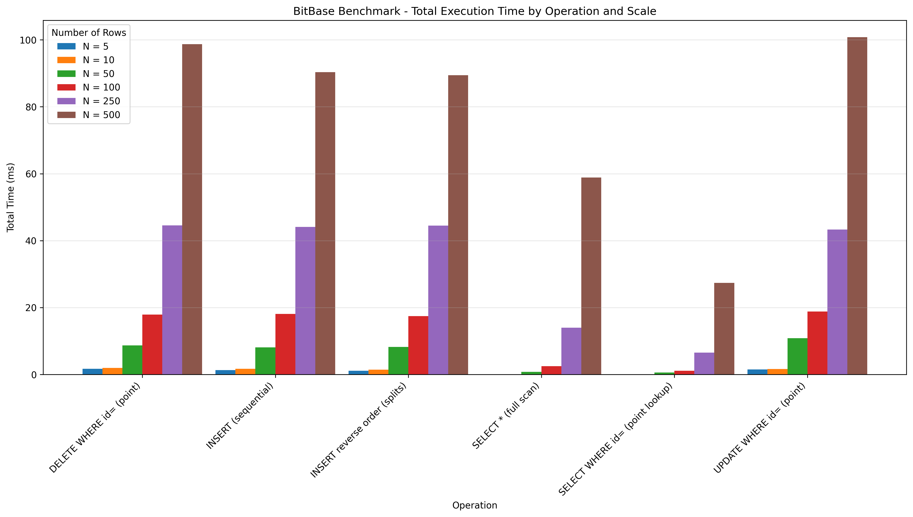
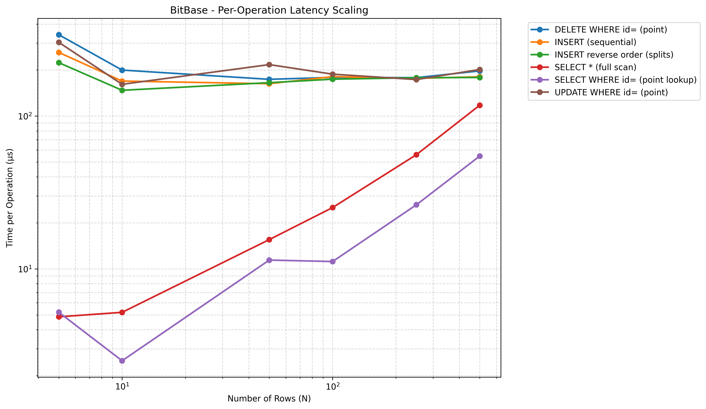
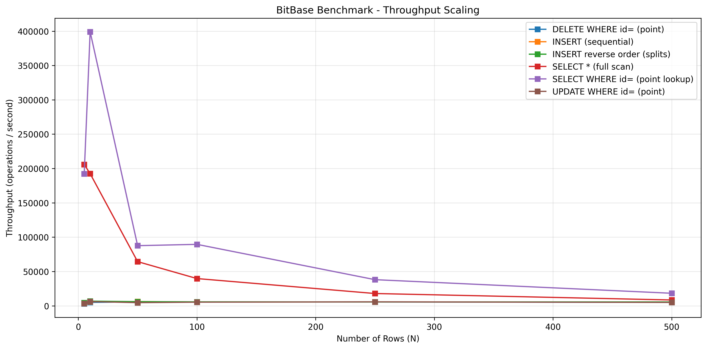

# BitBase

BitBase is a lightweight SQL-style database engine written in C++. The project is built as a learning-focused database system that covers the core pieces behind a relational database: SQL parsing, command execution, persistent storage, B+ tree indexing, transactions, and write-ahead logging.

The goal of BitBase is not to compete with production databases, but to demonstrate how a database works internally from the command line down to pages on disk.

## Project Highlights

- SQL-like command-line interface
- Tokenizer and parser for database statements
- Virtual machine layer that executes parsed statements
- Table storage backed by fixed-size pages
- B+ tree structure for primary-key storage
- Persistent schema and table files
- Write-ahead log for recovery-oriented storage behavior
- Basic transaction support with commit and rollback paths
- Benchmark suite with CSV output and generated visualizations

## Supported SQL Features

BitBase supports a practical subset of SQL:

- `CREATE TABLE`
- `DROP TABLE`
- `INSERT INTO ... VALUES`
- Multi-row inserts
- `SELECT * FROM ...`
- Column-specific `SELECT`
- `WHERE` filters with comparison operators
- `ORDER BY` with ascending or descending order
- `UPDATE ... SET ... WHERE ...`
- `DELETE FROM ...`

Example:

```sql
CREATE TABLE users (id INT PRIMARY KEY, name TEXT, score INT)
INSERT INTO users VALUES (1, 'Alice', 95)
INSERT INTO users VALUES (2, 'Bob', 88), (3, 'Carol', 91)
SELECT * FROM users ORDER BY score DESC
UPDATE users SET score = 99 WHERE id = 1
DELETE FROM users WHERE id = 2
```

## Architecture Overview

BitBase is organized into small components that mirror the layers of a database engine.

### Query Pipeline

User input flows through the following stages:

```text
SQL input -> tokenizer -> parser -> statement -> VM executor -> storage engine
```

- The tokenizer breaks raw SQL text into tokens.
- The parser converts tokens into structured `Statement` objects.
- The VM executes the statement against database tables.
- Storage components handle rows, pages, B+ tree operations, WAL, and persistence.

### Storage Layer

The storage layer uses fixed-size pages and table files. Rows are serialized into page cells, and primary-key records are organized through B+ tree leaf/internal nodes. This gives the project a realistic storage model instead of keeping all records only in memory.

### Transactions And WAL

BitBase includes a basic single-writer transaction model. Before page mutations, the database records page snapshots through the transaction/WAL path. On commit, dirty pages are flushed; on rollback, before-images are restored.

## Repository Structure

```text
.
├── main.cpp                         # Interactive BitBase shell
├── benchmark.cpp                    # Benchmark runner
├── plot_benchmark.py                # Graph generation script
├── headers/                         # Public project headers
├── src/
│   ├── tokenizer/                   # SQL tokenizer
│   ├── parser/                      # SQL parser
│   ├── vm/                          # Statement execution
│   ├── cursor/                      # Table traversal
│   └── storage/
│       ├── database/                # Database lifecycle/schema
│       ├── table/                   # Table abstraction
│       ├── Pager/                   # Page management
│       ├── b_plus_tree/             # B+ tree logic
│       ├── transaction/             # Transaction state
│       └── wal/                     # Write-ahead logging
└── benchmark_results.csv            # Generated benchmark data
```

## Build

Build the interactive database shell:

```bash
g++ -std=c++17 main.cpp \
  src/tokenizer/tokenizer.cpp \
  src/parser/parser.cpp \
  src/vm/vm.cpp \
  src/input_buffer/input_buffer.cpp \
  src/cursor/cursor.cpp \
  src/storage/database/db.cpp \
  src/storage/table/table.cpp \
  src/storage/Pager/pager.cpp \
  src/storage/b_plus_tree/b_plus_tree.cpp \
  src/storage/transaction/transaction.cpp \
  src/storage/wal/wal.cpp \
  -o bitbase
```

Run BitBase:

```bash
./bitbase
```

Useful shell commands:

```text
.help      show supported commands
.tables    list tables
.exit      close the database
```

## Benchmarking

Build the benchmark executable:

```bash
g++ -std=c++17 benchmark.cpp \
  src/tokenizer/tokenizer.cpp \
  src/parser/parser.cpp \
  src/vm/vm.cpp \
  src/input_buffer/input_buffer.cpp \
  src/cursor/cursor.cpp \
  src/storage/database/db.cpp \
  src/storage/table/table.cpp \
  src/storage/Pager/pager.cpp \
  src/storage/b_plus_tree/b_plus_tree.cpp \
  src/storage/transaction/transaction.cpp \
  src/storage/wal/wal.cpp \
  -o benchmark
```

Run the benchmark:

```bash
./benchmark 5 10 50 100 250 500
```

The benchmark measures:

- Sequential inserts
- Full-table scans
- `WHERE id = ...` filtered selects
- `WHERE id = ...` updates
- Primary-key deletes
- Reverse-order inserts to stress B+ tree splits

Results are written to `benchmark_results.csv`, and `plot_benchmark.py` generates the visualizations below.

## Benchmark Results

### Total Execution Time



This graph compares total runtime for each operation as the number of rows increases. Inserts, updates, deletes, and reverse-order inserts are more expensive than simple reads because they perform storage mutations and transaction/WAL work. Full scans increase with table size because each benchmark run reads through the table contents.

### Per-Operation Latency Scaling



This graph shows average time per operation. Insert and update latency stay in a relatively similar range across the tested sizes, while scan-based operations become more expensive as the table grows. Reverse-order inserts are included because they exercise B+ tree split behavior more directly than simple sequential inserts.

### Throughput Scaling



Throughput is calculated from per-operation latency. Faster read operations achieve higher operations per second, while write-heavy operations have lower throughput because each mutation passes through serialization, page updates, transaction handling, and disk flushing behavior.

## Result Interpretation

The results are consistent with the current implementation:

- Sequential inserts scale predictably for the tested input sizes.
- Full scans become slower as `N` increases, which is expected for table traversal.
- `SELECT WHERE id = ...` currently scans rows and applies a filter, so it should be interpreted as filtered-select performance rather than true indexed lookup performance.
- `UPDATE WHERE id = ...` also scans rows before applying updates.
- `DELETE WHERE id = ...` uses the primary-key delete path and is closest to a true point operation in the current implementation.
- Reverse-order inserts help demonstrate B+ tree split behavior under non-sequential insertion order.

## What This Project Demonstrates

BitBase demonstrates understanding of database internals beyond simply using an existing DBMS. The project covers parsing, execution planning at a small scale, row serialization, page-oriented storage, B+ tree organization, persistence, logging, and benchmark-driven evaluation.

Future improvements could include indexed `SELECT` and `UPDATE` paths for primary-key filters, stronger SQL grammar coverage, better query planning, more complete transaction isolation, and automated tests for storage recovery behavior.
